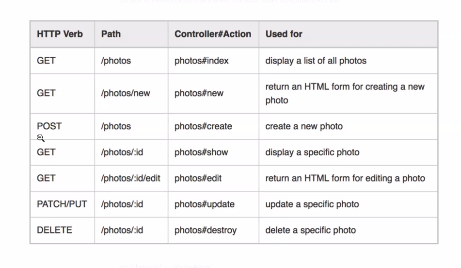

# REST API

**RE**presentation **S**tate **T**ransfer

## Guiding Principles

1. Uniform Interface
  * Resource identification through requests
  * Resource is separate from data returned to the client
  * Resource manipulation through representations
  * Self-descriptive messages
  * Hypermedia (links) as the engine of application state (HATEOAS)
2. Client-Server
  * Separation of concerns
  * front-end and back-end developed independently
  * RESTful API sends all necessary data to client
  * client determines how to display data
3. Stateless
  * Does not rely on configuration to operate
  * Should not care if item was just created, checked off, deleted to perform the next action
  * Session data should be sent by client
4. Cacheable
  * Data can be stored by the client
  * Allows the client to reuse data until expired or needs to be refreshed
  * Client does not need to interact with server repeatedly
5. Layered system
  * Should not be able to tell if client is directly connected to end server or another layer (proxy or load balancer)
6. Code on Demand
  * Optional principle
  * Can send executable code, scripts, applets for download and execution

## REST, HTTP, CRUD

* CRUD: Create, Read, Update, Delete
  * Create: `POST`
  * Read: `GET`
  * Update: `PATCH`, `PUT`
  * Delete: `DELETE`
* Advantages of REST
  * Scalability - can scale without impacting other parts of application
  * Portability - separate from client
  * Data Structure - sends JSON data instead of XML
  * Integration - easier to integrate into applications
* Disadvantages of REST
  * Version control and endpoint reliability
    * later version may not match earlier versions of API
  * More data than necessary
    * Usually sends more than needed, especially adhering to HATEAOS
  * False sense of security
    * Layered architecture does not mean data is safe by default
    * Applications still need encryption

## RESTful Routes

